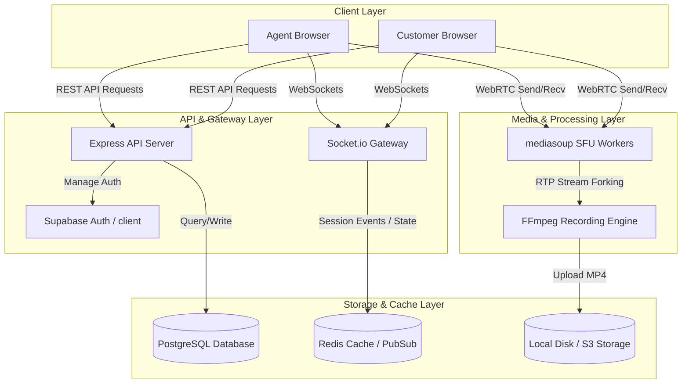
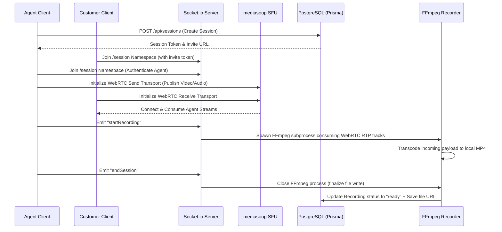

# 🛡️ NEXUS SUPPORT

**Real-Time Video Support Platform** — *See the Problem. Solve It Now.*

NEXUS SUPPORT is a highly optimized, enterprise-grade real-time video support application. Built around an open-source **mediasoup SFU (WebRTC)** topology, all video streams route through a centralized server with zero peer-to-peer connection dependencies. Support agents can easily spawn sessions and invite customers via secure tokenized links, while all operations sync securely to **Supabase** for identity management.

---

## 🏗️ System Architecture



---

## 📡 Core Workflow Sequence



---

## 🗂️ Project Directory Structure

```
NEXUS-SUPPORT/
├── .github/              # GitHub Actions CI/CD workflows
├── apps/
│   ├── api/              # Express API Server (Node + TypeScript + Prisma)
│   │   ├── prisma/       # Database Schemas & Seed scripts
│   │   ├── src/          # API Source code
│   │   │   ├── config/   # Environment variable validation & Mediasoup worker setup
│   │   │   ├── lib/      # DB Client, Logger, Supabase client initialization
│   │   │   ├── middleware/# CORS, Rate Limit, Auth guards, Prometheus metrics
│   │   │   ├── routes/   # REST Endpoints (Auth, Sessions, Files, Admin)
│   │   │   ├── services/ # Business Logic (Auth, Recording, Session lifecycle)
│   │   │   ├── socket/   # Socket.io Namespaces (Chat, Recording, Session, Mediasoup)
│   │   │   └── server.ts # Main server entry point
│   │   └── package.json  # Backend Dependencies
│   └── web/              # React Frontend Client (Vite + TypeScript + Zustand)
│       ├── public/       # Static assets and icons
│       ├── src/          # Frontend client source code
│       │   ├── components/# UI Components (Call Control Bar, Video Grid, Modals)
│       │   ├── hooks/     # Custom React hooks (useAuth, useSession, useSocket)
│       │   ├── lib/       # API axios instance & Supabase client setup
│       │   ├── pages/     # Views (Dashboard, Unified Login/Register, Session Room)
│       │   ├── providers/ # React context providers (Auth, Mediasoup, Socket.io)
│       │   └── App.tsx    # Router & View layout definitions
│       └── package.json  # Frontend Dependencies
├── docker-compose.yml    # Development multi-container environment descriptor
└── README.md             # Project documentation
```

---

## ⚙️ Tech Stack & Key Integrations

| Layer | Technologies Used | Details |
| :--- | :--- | :--- |
| **Frontend** | React 19, Vite, TypeScript, Zustand, TanStack Query, Framer Motion | Modern, glassmorphic UI layout with high-fidelity transitions. |
| **Backend** | Node.js 20, Express, Socket.io, TypeScript, Zod | Fast REST API endpoints paired with real-time WebSocket communication namespaces. |
| **Identity / Auth** | Supabase Auth | Synchronized authentication portal with fallback matching offline test accounts. |
| **Database & ORM** | PostgreSQL 16, Prisma ORM | Relational schema modeling with cascade deletion support. |
| **Cache & Queue** | Redis 7 | Used for token blacklisting, room presence synchronization, and socket locks. |
| **RTP Media Engine** | mediasoup v3 SFU | Pure WebRTC transport handlers facilitating high-bandwidth multi-cast streams. |
| **Transcoding** | FFmpeg | Background processing subprocess forks for audio/video stream combining. |

---

## 🚀 Deployment Instructions

### 1. Deploying the Backend API (e.g. via Railway)

1. Set up a **PostgreSQL** database and a **Redis** service instance on Railway.
2. Link your repository and configure the builder to point to `apps/api/Dockerfile` (or build using `npm install && npm run build` inside the root workspace).
3. Set the following required **Environment Variables** in the Railway service panel:

```env
NODE_ENV=production
PORT=8080
DATABASE_URL=postgresql://<user>:<password>@<host>:<port>/<db_name>?sslmode=require
REDIS_URL=redis://default:<password>@<host>:<port>
JWT_SECRET=super_secret_minimum_64_characters_long
SUPABASE_URL=https://your-project-id.supabase.co
SUPABASE_ANON_KEY=eyJhbGciOiJIUzI1NiIsInR5cCI6IkpXVCJ9...
MEDIASOUP_LISTEN_IP=0.0.0.0
MEDIASOUP_ANNOUNCED_IP=<your_public_ip_or_railway_domain>
```

---

### 2. Deploying the Frontend Client (e.g. via Vercel)

1. Create a new project on Vercel and import your repository.
2. Set the **Root Directory** settings to `apps/web`.
3. Add the following **Environment Variables**:

```env
VITE_API_URL=https://your-backend-railway-domain.app
VITE_SUPABASE_URL=https://your-project-id.supabase.co
VITE_SUPABASE_ANON_KEY=eyJhbGciOiJIUzI1NiIsInR5cCI6IkpXVCJ9...
```

4. Click **Deploy**. Vercel will build the production static files and serve them over HTTPS.

---

## 🛠️ Local Development Setup

### Prerequisites
* **Docker Desktop** installed on your host system.
* **Node.js v20+** installed.
* **Git** CLI.

### Installation Steps

1. **Clone the Repository**
   ```bash
   git clone https://github.com/Neerav02/NEXUS-SUPPORT.git
   cd NEXUS-SUPPORT
   ```

2. **Configure Local Environment**
   * Edit `apps/api/.env` and append your Supabase credentials:
     ```env
     SUPABASE_URL=https://your-project-id.supabase.co
     SUPABASE_ANON_KEY=eyJhbGciOiJIUzI1NiIsInR5cCI6IkpXVCJ9...
     ```
   * Create `apps/web/.env` and supply connection details:
     ```env
     VITE_API_URL=http://localhost:8080
     VITE_SUPABASE_URL=https://your-project-id.supabase.co
     VITE_SUPABASE_ANON_KEY=eyJhbGciOiJIUzI1NiIsInR5cCI6IkpXVCJ9...
     ```

3. **Start Core Services (Docker)**
   ```bash
   docker compose up -d
   ```
   *This starts the PostgreSQL database, Redis cache, and the hot-reloading API container on port `8080`.*

4. **Initialize Local Database**
   ```bash
   docker compose exec api npx prisma migrate dev
   docker compose exec api npx prisma db seed
   ```

5. **Start Frontend Web Client**
   ```bash
   cd apps/web
   npm install
   npm run dev
   ```

6. **Verify Services**
   * Open **Frontend Dashboard**: `http://localhost:5173/` (Auto-redirects to `/dashboard`).
   * Verify **API Server Status**: `http://localhost:8080/metrics` or check terminal container logs: `docker logs -f nexus-api`.
